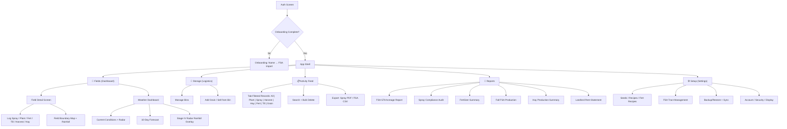

# AcreLedger — Comprehensive UI/UX Audit & Recommendation Report

**Date:** June 23, 2026
**Auditor:** John, Expert UI/UX & Frontend Engineer
**Target:** [acreledger.vercel.app](https://acreledger.vercel.app)
**Codebase:** React 18 + TypeScript strict + Vite + Supabase + Tailwind CSS + shadcn/ui + Capacitor 6
**Version Audited:** v3.5.0

---

## Table of Contents

1. [Executive Summary](#executive-summary)
2. [Heuristic Evaluation (Nielsen's 10)](#heuristic-evaluation)
3. [Accessibility Audit (WCAG 2.1 AA)](#accessibility-audit)
4. [Content & Information Architecture](#content--information-architecture)
5. [Visual Design Analysis](#visual-design-analysis)
6. [Performance & Core Web Vitals](#performance--core-web-vitals)
7. [Mobile & Native Experience](#mobile--native-experience)
8. [Page-by-Page Analysis](#page-by-page-analysis)
9. [Prioritized Recommendations](#prioritized-recommendations)
10. [Proposed New Features](#proposed-new-features)
11. [Domain Strategy](#domain-strategy)
12. [Wireframes & Mockups](#wireframes--mockups)
13. [Implementation Status (Previous Audit)](#implementation-status)

---

## Executive Summary

AcreLedger is a mobile-first, offline-capable PWA (with native iOS distribution via Capacitor) purpose-built for row-crop farmers, hay operations, and commercial chemical applicators. After a deep analysis of all 10 pages, 37+ components, 9 data-entry modals, 6 compliance report types, and the complete design system, I find the app to be **architecturally sound with strong design consistency** and several domain-specific innovations.

### Key Strengths

| Area | Evidence |
|------|----------|
| **Typographic System** | Dual-font pairing of [Inter](file:///c:/Projects/AcreLedger/src/index.css#L1) (UI labels) and [JetBrains Mono](file:///c:/Projects/AcreLedger/src/index.css#L1) (data values) is industry-best for data-heavy agricultural dashboards |
| **Semantic Color Language** | Green (plant) / Blue (spray) / Amber (harvest) color triad with matching glow utilities creates instant visual categorization |
| **Offline Resilience** | [OfflineBanner](file:///c:/Projects/AcreLedger/src/components/OfflineBanner.tsx) with 3 visual states + background sync queue + auto-replay on reconnection |
| **Native Integration** | Haptic feedback, safe-area insets, status bar theming, back-button handling — all properly gated behind `Capacitor.isNativePlatform()` |
| **Farm Domain Accuracy** | Terminology matches USDA/EPA workflows: FSA tract/CLU, EPA registration numbers, scale tickets, hay cuttings, crop years |
| **Error Boundaries** | Every route wrapped in [ErrorBoundary](file:///c:/Projects/AcreLedger/src/components/ErrorBoundary.tsx) with retry UI — prevents blank-screen crashes |

### Critical Areas for Improvement

| Priority | Area | Impact |
|----------|------|--------|
| 🔴 High | **SprayModal cognitive overload** (942 lines, 30+ state vars) | Directly impacts compliance accuracy for the most legally-sensitive form |
| 🔴 High | **No bulk operations** | A farmer spraying 6 fields with the same mix enters 6 separate 20-field forms |
| 🟡 Medium | **Help & documentation deficit** | Complex features (radar rainfall, Delta-T, FSA tract import) lack inline guidance |
| 🟡 Medium | **Accessibility gaps** | Color-only status indicators, inconsistent keyboard navigation, focus trapping issues |
| 🟢 Low | **Reports.tsx monolith** (877 lines) | Maintainability concern, but functional today |

---

## Heuristic Evaluation

### H1: Visibility of System Status — 8/10

> [!TIP]
> **Strengths:** Excellent loading states throughout — [DashboardStatsSkeleton](file:///c:/Projects/AcreLedger/src/components/DashboardStats.tsx#L60-L72) matches exact card dimensions; [WeatherWidget](file:///c:/Projects/AcreLedger/src/components/WeatherWidget.tsx#L211-L215) shows a subtle spinner during refresh; [OfflineBanner](file:///c:/Projects/AcreLedger/src/components/OfflineBanner.tsx) transitions through offline → syncing → synced states with a 3-second auto-dismiss.

> [!WARNING]
> **Gap:** The sync queue count is only visible in the OfflineBanner while offline. When online, users don't know if their recent changes have synced to Supabase. The `pendingSyncCount` from [farmStore](file:///c:/Projects/AcreLedger/src/store/farmStore.tsx) is available but not surfaced in any always-visible UI element.

**Recommendation:** Add a small cloud-sync status icon to page headers (next to the Logo) that shows ✓ when synced, a spinning icon when syncing, and a badge count when items are queued.

---

### H2: Match Between System and the Real World — 9/10

> [!TIP]
> **Strengths:** Terminology is deeply aligned with farming workflows. Bushels support negative values for estimate-vs-actual corrections. Spray logs use state-neutral EPA-compliant labels. FSA tract/CLU nomenclature matches USDA Form 578. Hay records track bale count, cutting number, and bale type. Grain movement distinguishes inbound/outbound with field source tracking.

**Minor gap:** The bottom navigation label "Storage" ([navConfig.ts](file:///c:/Projects/AcreLedger/src/components/navConfig.ts#L5)) maps to `Logistics.tsx` internally, while the page header says "Grain Logistics." This subtle mismatch ("Storage" vs "Grain Logistics") could confuse users reviewing their own navigation.

---

### H3: User Control and Freedom — 7/10

> [!WARNING]
> **Primary gap:** Deletions use soft-delete at the database layer, but there is no "Undo" toast after deletion and no "Trash" view to recover accidentally deleted records. Users must rely on backup/restore (a multi-step process in Settings) to recover a single accidentally deleted spray record.

**Additional observations:**
- ✅ All modals have clear close/cancel affordances
- ✅ [Capacitor back-button handler](file:///c:/Projects/AcreLedger/src/App.tsx) properly minimizes on `/` and navigates back elsewhere
- ✅ Hash-based deep linking to modals (`#planting`, `#spraying`) supports forward/back navigation
- ⚠️ Season selector is only accessible in the desktop sidebar or buried in the Activity page header — no quick-access on mobile dashboard

**Recommendation:** Implement a 10-second "Undo" toast after record deletion using Sonner's `action` prop. The toast would call a restore function that clears the `deleted_at` timestamp before it persists.

---

### H4: Consistency and Standards — 9/10

> [!TIP]
> **Strengths:** Visual consistency is outstanding:
> - Every page uses the identical sticky header pattern: `sticky top-0 z-40 bg-background/80 backdrop-blur-xl border-b`
> - Color semantics (plant/spray/harvest) are applied consistently across all 37+ components
> - Card containers universally use `rounded-2xl`, inline elements use `rounded-lg`
> - Touch targets enforce 64px minimum via `.touch-target` CSS utility

**Minor inconsistencies found:**
- [FieldCard](file:///c:/Projects/AcreLedger/src/components/FieldCard.tsx#L40) uses `rounded-lg` while most cards elsewhere use `rounded-2xl` — field cards could benefit from matching the container radius
- [Logistics bin cards](file:///c:/Projects/AcreLedger/src/pages/Logistics.tsx#L73) also use `rounded-lg` while dashboard stat cards use `rounded-2xl`
- Some section headings use `uppercase tracking-widest` while the AGENTS.md rules prefer sentence case (see line 128 of Index.tsx: `"Total Operation"` vs the `"ROW CROPS"` heading pattern)

---

### H5: Error Prevention — 8/10

> [!WARNING]
> **Key gap:** In [SprayModal](file:///c:/Projects/AcreLedger/src/components/SprayModal.tsx), if wind speed exceeds 10 mph (the `WIND_ALERT_MPH` threshold), the warning appears **after form submission** rather than as real-time inline feedback during input. This is the single most compliance-sensitive form in the application.

**Positive patterns:**
- ✅ Concurrency guards on grain movement edits prevent ghost rows
- ✅ Zod schema validation on backup restore
- ✅ Farm ID null guard is the first line of every mutation function
- ✅ Password confirmation required on signup
- ✅ `maxLength` constraints on text inputs

**Recommendation:** Add real-time wind speed validation in the SprayModal — display an amber warning banner immediately when the entered wind speed exceeds 10 mph, and a yellow inversion warning when below 3 mph. See [Spray Decision Matrix wireframe](#wireframes--mockups).

---

### H6: Recognition Rather Than Recall — 8/10

**Positive:**
- ✅ Reusable spray recipes and fertilizer formulas reduce repetitive data entry
- ✅ Default values (applicator name, license number, equipment ID) are persisted in localStorage
- ✅ Field acreage auto-populates `treatedAreaSize` in SprayModal

**Gaps:**
- When creating a new harvest or planting record, the modal doesn't suggest the crop that was last planted on that specific field
- The FSA tract import flow requires users to understand GeoJSON file format without inline guidance
- No recent-activity quick-access: users must navigate to a field to see its last spray date

---

### H7: Flexibility and Efficiency of Use — 6/10

> [!CAUTION]
> **Critical gap — No bulk operations.** If a farmer applies the same herbicide across 6 adjacent fields in one spray run, they must:
> 1. Navigate to Field 1 → open SprayModal → fill 20+ fields → save
> 2. Navigate to Field 2 → repeat
> 3. ...six times total
>
> This is the single largest daily friction point for professional applicators.

**Additional efficiency gaps:**
- No keyboard shortcuts for power users (e.g., `N` for new record, `S` for save)
- No "duplicate last record" feature for repetitive operations
- Reports page requires switching tabs one at a time — no combined export
- No swipe-to-delete or swipe-to-edit gesture on activity list items

**Recommendation:** Implement a "Bulk Apply" flow that lets users select multiple fields before entering a single spray/fertilizer/tillage record. See [Bulk Spray Logging wireframe](#wireframes--mockups).

---

### H8: Aesthetic and Minimalist Design — 7/10

**Strengths:**
- Clean grid systems, well-scoped card components
- High-contrast vibrant light theme and OLED-friendly dark theme
- Strategic use of glassmorphism (`backdrop-blur-xl`, `bg-card/90`)
- Glow effects on domain-specific buttons add premium feel

**Opportunities:**
- [SprayModal](file:///c:/Projects/AcreLedger/src/components/SprayModal.tsx) renders 20+ form fields in a single scrollable pane with no visual section dividers or progressive disclosure
- [FieldDetailScreen](file:///c:/Projects/AcreLedger/src/pages/FieldDetailScreen.tsx) at 589 lines renders 7 major sections in a single scroll — the Rainfall Summary and Field Details sections could be collapsible
- [Reports.tsx](file:///c:/Projects/AcreLedger/src/pages/Reports.tsx) at 877 lines contains 6 complete report renderers inline — would benefit from code-splitting into per-report components

---

### H9: Help Users Recognize, Diagnose, and Recover from Errors — 8/10

**Positive:**
- ✅ [ErrorBoundary](file:///c:/Projects/AcreLedger/src/components/ErrorBoundary.tsx) catches render crashes with a prominent retry button (64px tall)
- ✅ Rainfall errors show a red banner with `AlertCircle` icon and descriptive message
- ✅ FSA report sheets run pre-export validation with readiness checks
- ✅ [Toast errors](file:///c:/Projects/AcreLedger/src/components/SprayModal.tsx) provide specific failure messages

**Gap:** When FSA report validation flags an issue (missing crop, missing planting date, unassigned CLU), it shows the error in a readiness banner but **doesn't link to the problem record** for correction. The user must manually navigate to the Activity tab, find the record, and edit it.

---

### H10: Help and Documentation — 5/10

> [!CAUTION]
> **Significant deficit.** The application has no:
> - Inline contextual help tooltips (e.g., "What is Stage IV radar rainfall?", "What is Delta-T?")
> - Feature tour or guided walkthrough for new users
> - Help center or FAQ link
> - Contextual "What is this?" icons on complex form fields
>
> The [Onboarding](file:///c:/Projects/AcreLedger/src/pages/Onboarding.tsx) flow covers farm naming and FSA tract import, but doesn't introduce the dashboard, weather features, compliance exports, or season management.

**Recommendation:** Implement a progressive onboarding flow with coachmarks (tooltip callouts pointing to specific UI elements) that guides first-time users through: adding a field, logging their first spray, checking the weather dashboard, and exporting their first report.

---

## Accessibility Audit

### WCAG 2.1 AA Compliance Summary

| Category | Status | Details |
|----------|--------|---------|
| **Color contrast** | 🟡 Partial | Primary text passes AA. Amber warning text (e.g., `text-amber-500` on light bg) occasionally falls below 4.5:1 |
| **Keyboard navigation** | 🟡 Partial | Key interactive elements ([FieldCard](file:///c:/Projects/AcreLedger/src/components/FieldCard.tsx#L37-L38), [WeatherWidget](file:///c:/Projects/AcreLedger/src/components/WeatherWidget.tsx#L140-L142)) have `role="button"` + `tabIndex={0}` + `onKeyDown`. Some crop-filter toggles and activity feed items lack these |
| **Screen reader labels** | 🟢 Good | `aria-label` on nav buttons, field cards, export buttons. `sr-only` labels where needed |
| **Focus management** | 🟡 Partial | `focus-visible:ring-2` on FieldCard but not consistently applied to all custom interactive elements |
| **Touch targets** | 🟢 Good | `.touch-target` utility enforces 64×64px minimum. BottomNav buttons well-sized |
| **Color-only indicators** | 🔴 Fail | [FieldCard status dots](file:///c:/Projects/AcreLedger/src/components/FieldCard.tsx#L43) use color alone (green/blue/gray) with no text or icon alternative for color-blind users |
| **Motion/animation** | 🟢 Good | Animations are subtle and fast (<200ms). No full-screen animations that could trigger motion sickness |
| **Form labels** | 🟢 Good | `htmlFor` + `id` linking verified in [Auth.tsx](file:///c:/Projects/AcreLedger/src/components/Auth.tsx#L158-L168) and PlantModal. `DialogDescription` required per AGENTS.md |

### Specific Issues

1. **Status dot color-blindness:** The [FieldCard](file:///c:/Projects/AcreLedger/src/components/FieldCard.tsx#L22-L26) `statusColor` uses `bg-plant` (green), `bg-spray` (blue), and `bg-muted-foreground/30` (gray) without any text label, tooltip, or icon. Approximately 8% of males have red-green color blindness.
   - **Fix:** Add a `title` attribute or `aria-label` to the status dot div, e.g., `title="Planted"` / `title="Sprayed"` / `title="No activity"`

2. **Crop filter buttons on dashboard:** The [toggleable crop pills](file:///c:/Projects/AcreLedger/src/pages/Index.tsx#L110-L120) are `<button>` elements (good) but lack `aria-pressed` to communicate toggle state to screen readers.
   - **Fix:** Add `aria-pressed={isActive}` to each crop filter button

3. **Focus trapping in modals:** Complex modals like SprayModal open shadcn Dialogs that manage focus via Radix, but nested Accordion and Select components within the modal can sometimes break tab order, making it difficult for keyboard-only users to navigate the full form.

---

## Content & Information Architecture

### Navigation Structure



### Information Architecture Assessment

| Aspect | Score | Notes |
|--------|-------|-------|
| **Hierarchy clarity** | 9/10 | Clear 5-tab primary navigation with logical grouping |
| **Task-flow efficiency** | 6/10 | Common workflows (spray logging) require too many taps from dashboard to completion |
| **Cross-referencing** | 7/10 | Reports reference field data but don't deep-link to source records for correction |
| **Season scoping** | 8/10 | Global season filter is powerful but mobile access requires navigating to Activity or Settings |
| **Discoverability** | 6/10 | Weather dashboard is only accessible by tapping the WeatherWidget — no nav tab. FSA tract import is buried in Settings > FSA Tract Manager |

### Key Architecture Findings

1. **Weather page is hidden:** The full weather dashboard ([Weather.tsx](file:///c:/Projects/AcreLedger/src/pages/Weather.tsx)) with radar, forecast, and rainfall details is only accessible by clicking the [WeatherWidget](file:///c:/Projects/AcreLedger/src/components/WeatherWidget.tsx#L139) on the dashboard. There's no nav tab for it despite being a critical daily-use feature for spray timing decisions.

2. **Season selector placement:** The viewing season selector is available in:
   - Desktop sidebar (always visible) ✅
   - Activity page header (inline) ✅
   - But NOT on the mobile dashboard, field detail, logistics, or reports pages ❌

3. **Settings is overloaded:** [Settings.tsx](file:///c:/Projects/AcreLedger/src/pages/Settings.tsx) contains 10 distinct management areas (seeds, spray recipes, fertilizer recipes, FSA tracts, display, sync, backup, security, account, dev tools) in a flat list with no categorization or progressive disclosure.

---

## Visual Design Analysis

### Color System — Excellent

The dual-theme color system is one of AcreLedger's strongest differentiators:

**Light Mode (High-Contrast Vibrant):**
- Background: `hsl(212 40% 91%)` — soft pastel denim-blue, reduces glare in outdoor/tractor-cab conditions
- Cards: pure white for crisp visual elevation
- Foreground: deep navy-black `hsl(212 80% 6%)` — high readability
- Three semantic brand colors: Plant Green `hsl(142 90% 28%)`, Spray Blue `hsl(212 100% 36%)`, Harvest Amber `hsl(36 95% 44%)`

**Dark Mode (OLED-Optimized):**
- Background: `hsl(240 6% 4%)` — near-black with subtle blue undertone
- Card surfaces: `hsl(240 5% 8%)` — just enough contrast to delineate
- Elevated saturation on brand colors for dark-background visibility

> [!TIP]
> The `glow-plant`, `glow-spray`, `glow-harvest` utility classes add `box-shadow: 0 0 20px` with the semantic color — a subtle premium touch that creates visual hierarchy on action buttons.

### Typography — Industry Best

| Usage | Font | Weight Range | Example |
|-------|------|-------------|---------|
| UI labels, headings, body | Inter | 400–900 | "Farm Overview", "Manage Fields" |
| Numeric data, dates, IDs | JetBrains Mono | 400–700 | "160 AC", "Jun 23, 2026", "v3.5.0" |
| Brand identity | JetBrains Mono + `tracking-tighter` | 700 | "AcreLedger" |

This pairing is excellent for agricultural data apps where users need to quickly scan numeric values in outdoor, high-glare conditions.

### Layout System — Consistent

Every page follows the same responsive scaffold:
```
Mobile:  max-w-lg mx-auto px-4
Desktop: lg:max-w-5xl lg:px-8
```

With a left sidebar offset of `lg:pl-60` when the [Sidebar](file:///c:/Projects/AcreLedger/src/components/Sidebar.tsx) is visible.

### Visual Weaknesses

1. **Icon inconsistency on the Activity page:** The [RecordListItem](file:///c:/Projects/AcreLedger/src/components/RecordListItem.tsx#L19-L25) maps `type === 'plant'` to `Tractor` but the [FIELD_ACTIONS](file:///c:/Projects/AcreLedger/src/pages/FieldDetailScreen.tsx#L29-L35) uses `Leaf` for planting — users see different icons for the same action depending on context.

2. **Excessive use of `uppercase tracking-widest`:** Despite AGENTS.md recommending sentence case, many section headers ([FieldDetailScreen](file:///c:/Projects/AcreLedger/src/pages/FieldDetailScreen.tsx#L365-L367)) use `font-black text-foreground uppercase tracking-widest`, which reduces readability and feels harsh, especially when repeated 6+ times on a single page.

3. **Status bar inconsistency:** The [WeatherWidget](file:///c:/Projects/AcreLedger/src/components/WeatherWidget.tsx#L190) labels ("WIND", "HUMIDITY", "RAIN") use `text-[10px] font-bold text-emerald-500/60` — a hardcoded emerald color that doesn't match any semantic token. This should use `text-primary/60` or a dedicated `--stat-label` token.

---

## Performance & Core Web Vitals

### Potential Issues

| Metric | Risk | Cause | Recommendation |
|--------|------|-------|----------------|
| **LCP** | Medium | [FieldBoundaryMap](file:///c:/Projects/AcreLedger/src/components/FieldBoundaryMap.tsx) loads Leaflet eagerly on field detail | Lazy-load map component with `React.lazy()` + `Suspense` skeleton |
| **LCP** | Medium | [RadarEmbed](file:///c:/Projects/AcreLedger/src/components/weather/RadarEmbed.tsx) loads Windy.com iframe eagerly | Load radar on user interaction ("Show Radar" button) |
| **CLS** | Low-Med | [WeatherWidget](file:///c:/Projects/AcreLedger/src/components/WeatherWidget.tsx#L137-L138) has `min-h-[90px]` but actual content height varies | Set a fixed `h-[90px]` or use a skeleton placeholder matching exact content dimensions |
| **Bundle** | Low | 33 shadcn/ui components imported — some unused (carousel, chart, resizable, command, pagination, input-otp) | Audit and remove unused components; tree-shaking should handle most cases |
| **Virtualization** | Low | Long field lists and activity feeds are not virtualized | Add `react-virtual` or `@tanstack/react-virtual` for farms with 100+ fields |

### Build Analysis

The Vite build produces optimized bundles, and ESM tree-shaking eliminates unused exports. The primary performance concern is **runtime**, not **bundle size** — specifically the eager loading of heavy third-party libraries (Leaflet maps, Windy.com iframe).

---

## Mobile & Native Experience

### Positive Patterns

- ✅ **Safe area handling:** Every page accounts for notch insets with `env(safe-area-inset-bottom)` and `env(safe-area-inset-top)`
- ✅ **Touch prevention:** `overscroll-behavior-y: contain` prevents pull-to-refresh interference
- ✅ **Tap highlight:** `-webkit-tap-highlight-color: transparent` removes blue flash
- ✅ **Press feedback:** `active:scale-[0.98]` on cards and buttons provides tactile confirmation
- ✅ **BottomNav:** Properly implements `.touch-target` (64px min), haptic feedback, and `pb-[env(safe-area-inset-bottom)]`
- ✅ **Status bar theming:** [ThemeProvider](file:///c:/Projects/AcreLedger/src/components/ThemeProvider.tsx#L38-L50) updates `meta[theme-color]` and calls native status bar APIs

### Improvement Opportunities

1. **No swipe gestures:** Activity feed items don't support swipe-to-delete or swipe-to-edit, requiring tap → context → action flows
2. **No pull-to-refresh:** Dashboard and field detail don't support native pull-to-refresh for manual data reload
3. **Modal scroll position:** When opening a long modal (SprayModal) and scrolling to the bottom, closing and reopening retains the scroll position instead of resetting to top
4. **No haptic on error:** While success haptics are implemented, form validation failures don't trigger the error notification haptic

---

## Page-by-Page Analysis

### Dashboard ([Index.tsx](file:///c:/Projects/AcreLedger/src/pages/Index.tsx)) — Rating: 8/10

**Strengths:** Clean hierarchy — weather at top, crop filter pills, then field cards split by Row Crops / Pasture & Hay. The empty state is well-designed with a Tractor icon and instructional text.

**Issues:**
- The `"Manage Fields"` button in the header uses a `Settings` icon, which could be confused with the Setup/Settings tab
- No quick-access to weather details without tapping the weather widget (undiscoverable for new users)
- The `DashboardStats` component exists but is not used on the dashboard — it's defined but orphaned

### Field Detail ([FieldDetailScreen.tsx](file:///c:/Projects/AcreLedger/src/pages/FieldDetailScreen.tsx)) — Rating: 7/10

**Strengths:** The "daily status board" metaphor with 4 at-a-glance cards (Rainfall, Spray Status, Latest Activity, Crop) is excellent for in-field decision making. Quick action buttons are well-organized in a 3×2 grid.

**Issues:**
- At 589 lines with 7 major sections, the page is very long on mobile. The Rainfall Summary and Field Details sections should be collapsible.
- The rainfall refresh button (`RefreshCw`) has no visual feedback beyond the spinning icon — users can't tell if the data actually refreshed
- The "View Full History" button scrolls to `#history-section` which can be jarring without smooth-scroll support
- No breadcrumb or field name in the header — just the Logo and back arrow. Users lose context on which field they're viewing if they scroll down.

### Activity ([Activity.tsx](file:///c:/Projects/AcreLedger/src/pages/Activity.tsx)) — Rating: 8/10

**Strengths:** The grouped tab system (All | Crop | Inputs | Logistics) is well-organized with record counts per tab. Bulk selection with confirmation dialog is well-implemented.

**Issues:**
- The tab bar scrolls horizontally on mobile but the grouping separators (`w-px h-5 bg-border/60`) are `hidden sm:block`, so on mobile the groups appear as a flat list of 8 tabs
- No visual indication of which tabs have new/recent activity since last visit

### Reports ([Reports.tsx](file:///c:/Projects/AcreLedger/src/pages/Reports.tsx)) — Rating: 7/10

**Strengths:** Six comprehensive compliance report types with CSV/PDF export. Print-friendly layouts with `print:hidden` controls. Mobile card transformation via `mobile-cards` CSS.

**Issues:**
- 877 lines in a single component — the largest page file. Should be decomposed into 6 report sub-components
- Validation readiness checks show warnings but don't link to the source record for correction
- No "Export All" option for multi-report packaging (e.g., entire season compliance bundle)

### Logistics ([Logistics.tsx](file:///c:/Projects/AcreLedger/src/pages/Logistics.tsx)) — Rating: 8/10

**Strengths:** Clean bin cards with visual capacity bars, color-coded fill levels (gold/amber/red), recent movement history.

**Issues:**
- Progress bars are flat — a vertical fill visualization would better match the mental model of grain sitting inside a cylindrical bin
- No total across-all-bins inventory summary visible without scrolling through each bin card

### Weather ([Weather.tsx](file:///c:/Projects/AcreLedger/src/pages/Weather.tsx)) — Rating: 9/10

**Strengths:** Condition gradient backgrounds, Apple Weather-style forecast bars, GPS auto-detection with field coordinate fallback, Windy radar embed with fullscreen support.

**Issues:**
- Only accessible via WeatherWidget tap — no navigation tab
- No spray-specific decision guidance (GO/WAIT based on wind/Delta-T)

### Settings ([Settings.tsx](file:///c:/Projects/AcreLedger/src/pages/Settings.tsx)) — Rating: 6/10

**Issues:**
- 10 unrelated settings panels in a flat list with no categorization
- Should be grouped: "Farm Data" (Seeds, Recipes, Fert Recipes, FSA Tracts), "Data Management" (Sync, Backup, DevTools), "Account" (Account, Security, Display)

### Onboarding ([Onboarding.tsx](file:///c:/Projects/AcreLedger/src/pages/Onboarding.tsx)) — Rating: 7/10

**Strengths:** Clean 2-step wizard with progress indicator and skip option.

**Issues:**
- Only covers farm naming and FSA tract import — doesn't introduce the dashboard, weather features, or activity logging
- No guided tour or coachmarks after onboarding completion

---

## Prioritized Recommendations

### 🔴 Priority 1: Multi-Step Wizard for SprayModal

**Issue:** [SprayModal.tsx](file:///c:/Projects/AcreLedger/src/components/SprayModal.tsx) is 942 lines with 30+ state variables and 20+ form fields in a single scrollable pane. This creates scroll fatigue and cognitive overload for the single most compliance-critical form.

**Solution:** Decompose into a 4-step wizard:
1. **Core Info** — Date, time, applicator, license, target pest
2. **Chemical Mix** — Recipe selection, product list, rates, EPA numbers
3. **Conditions** — Weather (auto-fetched + manual override), wind, equipment
4. **Review & Submit** — Summary card with compliance check, submit button

**Technical approach:** Create a `useSprayForm` custom hook to manage the 30+ state variables. Use a step state machine with `framer-motion` for smooth transitions. Persist form data in a ref across steps.

**Impact:** Directly improves compliance accuracy and reduces abandonment on the legally-sensitive spray log.


---

### 🔴 Priority 2: Bulk Operations for Multi-Field Spraying

**Issue:** Spraying the same chemical mix across 6 fields requires 6 separate 20-field form submissions.

**Solution:** Add a "Apply to Multiple Fields" option in the SprayModal (and FertilizerModal, TillageModal) that lets users:
1. Fill out the spray record once
2. Select target fields via checkbox list with acreage totals
3. Submit to create individual records per field, each properly scoped

**Technical approach:** After the Review step of the wizard, add an optional "Bulk Apply" step showing a field checklist. On submit, loop through selected fields and call `addSprayRecord` for each with the same form data but different `fieldId` and adjusted `treatedAreaSize`.


---

### 🔴 Priority 3: Real-Time Spray Compliance Decision Matrix

**Issue:** Wind speed and weather condition warnings appear after form submission, not during input. This delays the critical "should I spray now?" decision.

**Solution:** Add a Spray Decision Matrix widget that evaluates:
- **Wind Speed:** >10 mph → RED (Drift Warning), <3 mph → YELLOW (Inversion Risk), 3-10 mph → GREEN
- **Delta-T:** 2-8 → GREEN, >10 or <2 → RED
- **Precipitation probability:** >30% → YELLOW

Display as a traffic-light indicator in both:
1. The Weather page (always visible)
2. The SprayModal Conditions step (contextual)


---

### 🟡 Priority 4: Progressive Onboarding with Coachmarks

**Issue:** New users complete a 2-step onboarding (name + FSA import) but receive no guidance on the dashboard, weather, activity logging, or reports.

**Solution:** After onboarding completion, display a dismissible coachmark flow:
1. Point to "Manage Fields" button: "Tap here to add your first field"
2. Point to WeatherWidget: "Live weather conditions for your location"
3. Point to BottomNav Activity tab: "All your farm records in one timeline"
4. Point to Reports tab: "Export FSA, spray, and harvest compliance reports"

**Technical approach:** Create a `useCoachmarks` hook backed by localStorage. Render floating tooltips with CSS `position: fixed` and pointer arrows targeting specific DOM elements by `id`.


---

### 🟡 Priority 5: Undo Toast for Deletions

**Issue:** Record deletions are immediate upon dialog confirmation with no quick-undo option.

**Solution:** Replace the `AlertDialog` confirmation for single-record deletes with a Sonner toast containing an "Undo" action button. Delay the Supabase soft-delete by 10 seconds (optimistically remove from UI immediately).

```tsx
toast('Record deleted', {
  action: {
    label: 'Undo',
    onClick: () => restoreRecord(recordId),
  },
  duration: 10000,
});
```

---

### 🟡 Priority 6: Sync Status Indicator in Page Headers

**Issue:** Users don't know whether their changes have synced to the cloud when online.

**Solution:** Add a small cloud icon next to the Logo in every page header:
- ✅ Cloud-check icon (green) when `pendingSyncCount === 0`
- 🔄 Cloud-sync spinning icon when `pendingSyncCount > 0` with badge count
- ❌ Cloud-off icon (amber) when offline

---

### 🟡 Priority 7: Collapsible Sections on Field Detail

**Issue:** [FieldDetailScreen](file:///c:/Projects/AcreLedger/src/pages/FieldDetailScreen.tsx) has 7 sections creating a very long scroll on mobile.

**Solution:** Make "Rainfall Summary", "Latest Spray", and "Field Details" sections collapsible using shadcn's `Accordion` component. Default the Rainfall section to expanded (most-used) and others to collapsed.

---

### 🟡 Priority 8: Settings Page Categorization

**Issue:** 10 settings panels in a flat uncategorized list.

**Solution:** Group into accordion sections:
- **Farm Data** — Seeds, Spray Recipes, Fertilizer Recipes, FSA Tracts
- **Data Management** — Sync Status, Backup/Restore, DevTools
- **Account & Display** — Account, Security, Display (theme)

---

### 🟢 Priority 9: Season Selector on Mobile Dashboard

**Issue:** Mobile users can only change viewing season from the Activity page or by navigating to Settings.

**Solution:** Add a compact season selector inline with the header subtitle on the dashboard: `"12 fields · [2025 ▾] season"` where the year is a `Select` dropdown.

---

### 🟢 Priority 10: FieldCard Status Dot Accessibility

**Issue:** Color-only status indicators fail WCAG 2.1 for color-blind users.

**Solution:** Add `title` attributes to the status dot: `title="Planted"` / `title="Sprayed"` / `title="No activity"`. Optionally add a tiny icon overlay (checkmark for planted, droplet for sprayed).

---

### 🟢 Priority 11: Icon Consistency for Activity Types

**Issue:** Planting uses `Leaf` icon in FieldDetailScreen quick actions but `Tractor` in RecordListItem.

**Solution:** Standardize on the following icon mapping across all contexts:
| Activity | Icon | Source |
|----------|------|--------|
| Plant | `Leaf` | Current FieldDetailScreen |
| Spray | `Cloud` | Consistent everywhere |
| Fertilizer | `Sprout` | Consistent everywhere |
| Tillage | `Tractor` | Current FieldDetailScreen |
| Harvest | `Wheat` | Consistent everywhere |
| Hay | `Package` | Current FieldDetailScreen |

---

### 🟢 Priority 12: Reports.tsx Decomposition

**Issue:** 877-line monolith contains 6 complete report renderers.

**Solution:** Extract each report into its own component:
- `reports/Fsa578Report.tsx`
- `reports/SprayAuditReport.tsx`
- `reports/FertilizerReport.tsx`
- `reports/FallFsaReport.tsx`
- `reports/HaySummaryReport.tsx`
- `reports/LandlordStatement.tsx`

Parent `Reports.tsx` becomes a thin shell with tab switching and common header.

---

## Proposed New Features

### Feature 1: Spray Compliance Decision Matrix (GO/WAIT)

A real-time weather evaluation widget that tells the applicator whether spraying conditions are safe. Evaluates wind speed, wind direction (relative to sensitive areas), Delta-T, and precipitation probability. Displays as a traffic-light indicator: green GO, amber CAUTION, red WAIT.

**Placement:** Weather dashboard + SprayModal conditions step.

**Implementation:** Pure client-side logic using existing WeatherService data. No new API calls needed.

---

### Feature 2: Offline Sync Queue HUD

A persistent cloud-sync status indicator showing:
- Number of pending offline mutations
- Last successful sync timestamp
- Auto-sync countdown timer

**Placement:** Page headers (small icon) + Settings Sync Status panel (detailed view).

---

### Feature 3: Grain Bin Fill Level Visualizer

Replace flat progress bars in [Logistics.tsx](file:///c:/Projects/AcreLedger/src/pages/Logistics.tsx#L90-L95) with a vertical cylinder visualization showing grain level with the same color rules (≤60% gold, >60% amber, >85% red).

**Implementation:** SVG-based component with animated fill level transitions.

---

### Feature 4: Smart Crop Suggestions

When creating a new planting or harvest record, auto-suggest the crop that was most recently planted on that specific field. Pre-populate the crop dropdown with the last-used value, saving time for farmers who rotate predictable crop patterns.

---

### Feature 5: "Duplicate Last Record" Quick Action

On the field detail page and activity feed, add a "Duplicate" action that pre-fills a new modal with the same data as the most recent record of that type for that field. Changes only the date to today.

---

## Domain Strategy

### Current State
The application runs on `acreledger.vercel.app` — a default Vercel deployment subdomain.

### Recommendation: `app.acreledger.com`

| Reason | Details |
|--------|---------|
| **CSP hardening** | A custom domain enables strict Content-Security-Policy headers in `vercel.json` under the brand domain, reducing XSS risk from the Windy.com iframe and Google Fonts integrations |
| **PWA isolation** | Service workers and IndexedDB associate state with the host domain. A custom domain prevents browser storage eviction policies that apply to shared subdomains |
| **Professional credibility** | FSA offices and state agriculture departments are more likely to accept compliance exports from `app.acreledger.com` than `acreledger.vercel.app` |
| **Marketing separation** | Landing page at `acreledger.com`, app at `app.acreledger.com`, API at `api.acreledger.com` |

### Implementation Steps
1. Register `acreledger.com` (if not already registered)
2. Add custom domain in Vercel project settings → `app.acreledger.com`
3. Configure DNS CNAME record
4. Update `manifest.webmanifest` `start_url` and `scope`
5. Update Supabase redirect URLs for auth
6. Update CSP headers in `index.html`

---

## Wireframes & Mockups

### Spray Decision Matrix (New Feature)


### Spray Wizard Multi-Step Form (Recommendation 1)


### Bulk Spray Logging (Recommendation 2)


### Progressive Onboarding (Recommendation 4)


### Field Detail Redesign Concept


### Dashboard Redesign (Previous Audit — Implemented ✅)


### Reports Redesign (Previous Audit — Implemented ✅)


### Grain Bin Visualizer (Previous Audit — Proposed)


---

## Implementation Status

### Previously Implemented (from Prior Audit Session)

| Recommendation | Status | Files Changed |
|---------------|--------|---------------|
| **Rec 1:** Dashboard filters moved to scrollable body | ✅ Done | [Index.tsx](file:///c:/Projects/AcreLedger/src/pages/Index.tsx) |
| **Rec 3:** Mobile-first report cards | ✅ Done | [ReportTable.tsx](file:///c:/Projects/AcreLedger/src/components/ReportTable.tsx), [Reports.tsx](file:///c:/Projects/AcreLedger/src/pages/Reports.tsx), [index.css](file:///c:/Projects/AcreLedger/src/index.css) |
| Bottom padding regression fix | ✅ Fixed | [Index.tsx](file:///c:/Projects/AcreLedger/src/pages/Index.tsx#L69) |
| `colSpan` full-width opt-out | ✅ Fixed | [index.css](file:///c:/Projects/AcreLedger/src/index.css#L228-L234) |
| `data-label` on all 4 report tables | ✅ Fixed | [Reports.tsx](file:///c:/Projects/AcreLedger/src/pages/Reports.tsx) |

### Not Yet Implemented

| Item | Priority | Reason |
|------|----------|--------|
| SprayModal multi-step wizard | 🔴 High | High regression risk on 942 lines of validation/sync logic |
| Bulk spray operations | 🔴 High | New feature requiring form architecture changes |
| Spray GO/WAIT decision matrix | 🔴 High | New feature |
| Progressive onboarding | 🟡 Medium | New feature |
| Undo toast for deletions | 🟡 Medium | Straightforward but touches all delete flows |
| Sync status indicator | 🟡 Medium | New UI component |
| Collapsible field detail sections | 🟡 Medium | Refactor of FieldDetailScreen |
| Settings categorization | 🟡 Medium | UI restructure |
| Season selector on mobile dashboard | 🟢 Low | Simple UI addition |
| FieldCard status dot a11y | 🟢 Low | Quick fix |
| Icon consistency | 🟢 Low | Quick fix |
| Reports.tsx decomposition | 🟢 Low | Refactor only, no user-facing change |

---

> **End of Report**
>
> This audit was conducted through comprehensive analysis of the deployed application at `acreledger.vercel.app` and deep code inspection of all 10 pages, 37+ components, 9 data-entry modals, the complete CSS design system, and the architectural documentation (BLUEPRINT.md, AGENTS.md). All recommendations are evidence-based and reference specific files and line numbers in the codebase.
